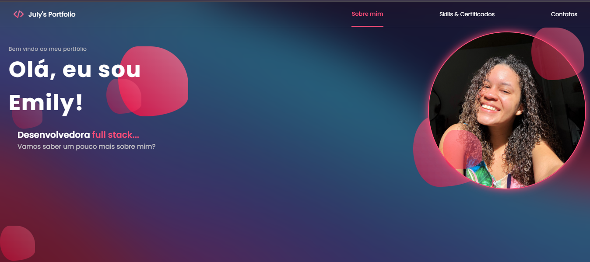

<h1 align="center">💜 July's Portfolio 💜</h1>
Esse é o meu novo portfólio com atualizações sobre minhas experiências profissionais e com um design mais clean e moderno, com efeitos de transparência que deixa a visualização leve e dinâmica. Ele reúne informações profissionais resumidas sobre mim, e ainda está em produção, será adicionadas novas features em breve. 🚀

<a href="https://new-portfolio-emilyjulys-projects.vercel.app/projects" target="_blank"> - Acesse aqui 🔗</a>

  

Esse portfólio foi desenvolvido em React! E é resposivo para dispositivos mobiles.

